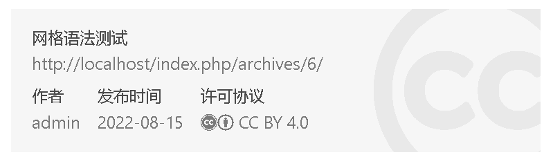

# CopyDog：版权狗插件

英语里有个词叫做「Copycat」，指的是喜欢模仿、抄袭他人的人；中文里又有个词叫做「版权狗」，指那些喜欢把版权一事挂在嘴边批评别人，以此来显得自己十分伟大光荣正确的那些人。
而在人们普遍的思想里，猫（Cat）的对立面是狗（Dog），我们不妨把这两个词的意思中和一下，造一个新词「CopyDog」，
来指那些真正愿意捍卫版权的人。

**CopyDog** 是一个简单的 Typecho 插件，它能让你在文章末尾生成一个显示文章版权信息的小卡片，就像这样：



你可能看出来了，这个卡片的设计参考了 Hexo 的 [icarus 主题](https://github.com/ppoffice/hexo-theme-icarus)。
并且这里采用的许可协议是著名的 Creative Commons。

## 使用

> **注意：**这个插件是为 Typecho 设计的，只有 Typecho 能够正常使用

1. 克隆 `git clone` 或者直接下载本仓库
2. 将文件夹重命名为 `CopyDog`（注意大小写）
3. 将插件文件夹放入 Typecho 安装目录下的 `/usr/plugins/` 目录
4. 登陆后台，启用 CopyDog 插件
5. 根据提示设置插件，如果不理解设置的内容，可以往下看
6. 修改主题文件，通常是 `post.php`，在 `<?php $this->content(); ?>` 之后写入 `<?php $this->copyDog($this); ?>`；
如果找不到 `post.php`，找到 `single.php`，在同样的位置写入 `<?php if($this->is('post')){ $this->copyDog($this);} ?>`

Enjoy~

## 说明

这里对 CopyDog 插件的功能做一些简单的说明。

### 内置的许可协议

CopyDog 内置的许可协议都来自 Creative Commons，许多人可能不知道的是，Creative Commons 有许多版本的协议供创作者选择，
而不只是 2.0、3.0、4.0 这样的迭代版本，CopyDog 插件也只采用 4.0 版本的协议。

要了解这些版本的差别，我们就要了解一些概念：

- BY：即介词 by，表示「出自...之手」，更正式的说法是 Attribution（署名）。大部分 CC 协议都要求署名，指出转载或修改之前的原作者是谁。
- SA：即 Share Alike，表示「同样地分享」，带有 SA 标识的 CC 协议要求转载/修改者在传播原版或自己修改后的版本的时候，也使用同样的 CC 协议。
- NC：即 Non-Commercial，表示「非商用」，带有 NC 标识的 CC 协议要求转载/修改者不得将原版或修改后的内容用作商业用途。
- ND：即 No Derivatives，表示「不得创作衍生产品」，带有 ND 标识的 CC 协议要求转载/修改者不得在原版的基础上创作衍生内容并传播。

例如，CC BY-NC-SA 协议的要求是：需要署名，不得用作商业用途，传播原版或修改后的版本时需要同样用 CC BY-NC-SA 协议授权。

除了带有以上标识的协议，还有以下较为特殊，不能称作协议的版权声明：

- PD：即 Public Domain，表示作品属于公共领域，自己不持有版权。
- CC0：即 No Rights Reserved，表示自己不保留作品的所有权利。
- All rights reserved：表示保留作品的所有权利，这个表达经常能在一些企业网站的页脚看到。

PD 和 CC0 表示作品可以随意使用，甚至不必署名；All rights reserved 表示，原则上，作品不允许转载和修改。
当然，这三个声明对于个人博客并不常用。

### 默认的许可协议

设置主题时需要选择一个默认的许可协议，只要单个文章没有特别规定使用哪个协议，就会选用这个默认的协议并且显示在页脚的卡片里。

如果要对单个文章特别指定许可协议，则需要在编辑文章时，在「自定义字段」里添加一个叫做 `copydog` 的字段，然后这样填写：

- `by`：表示使用 CC BY 协议
- `by-sa`：表示使用 CC BY-SA 协议
- `by-nc`：表示使用 CC BY-NC 协议
- `by-nd`：表示使用 CC BY-ND 协议
- `by-nc-nd`：表示使用 CC BY-NC-ND 协议
- `by-nc-sa`：表示使用 CC BY-NC-SA 协议
- `ARR`：声明「保留所有权利」
- `PD`：声明「作品属于公共领域」
- `CC0`：声明「不保留任何权利」
- `off`：不显示版权信息卡片

填写以上字段以外的其他任何内容，卡片会照常显示，但是会显示一个不存在许可协议，请不要这样做。

### 复制版权信息按钮

这个功能可以在插件设置里关掉，如果不关掉，则会在版权信息卡片的右下角显示一个纯文字按钮「复制版权信息」。
点击这个按钮之后就会复制一段声明文章版权所属的文段，它看起来是这样的：

```
本文「<title>」原文地址为 <link>，转载/修改已获得 <license> 协议授权。
```

如果你是主题开发者，你可以在你的 js 文件里加入以下内容，用来定义复制版权信息后的事件

```javascript
copydog_copied=function(){
    //例如 alert('复制成功！');
}
```

---

Copyright &copy; 2022 [Eltrac](https://github.com/BigCoke233), under MIT License.
